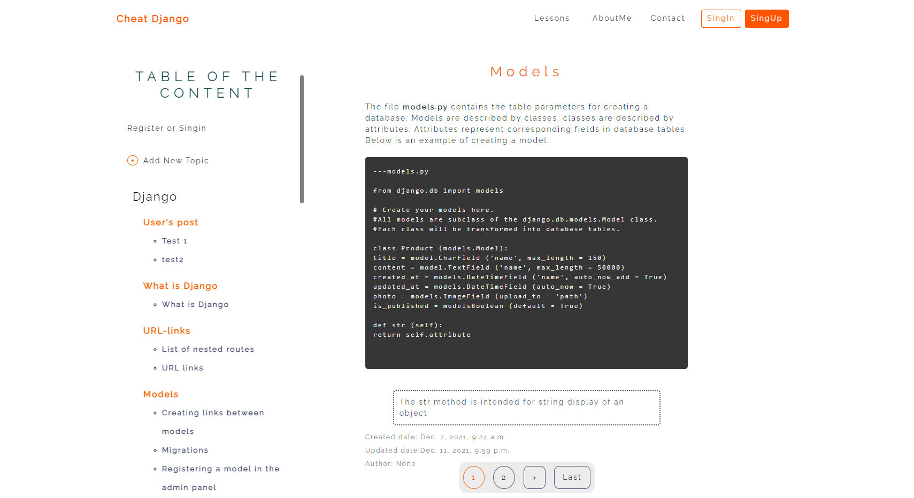

Link to project: https://cheat-django.herokuapp.com/<br />
Screenshots attached on the very bottom<br />

Purpose of this project was to <br />
learn basic Django 3.2.9, MVT, ORM<br />
DjangoDebugToolbar, Authorization, STMP<br />
HTML, CSS, Jinja2<br />
###### 06.2021 @dianaGera
<br />
<br />

# Build the project:

<br />

## Setup
The first thing to do is to clone the repository:

```sh
$ git clone https://github.com/dianaGera/django-cheat-sheets.git
$ cd django-cheat-sheets
```
## Create and activate virtual environment:
```sh
$ python3 -m venv venv
$ venv\Scripts\activate (Windows)
$ source venv/bin/activate (Linux)
```

## Install dependensies for backend:
```sh
pip install -r requirements.txt
```


## Restore the database using raw SQL

#### Create the PostgreSQL database
[Set up PostgreSQL on Windows/Mac/Linux](https://www.codecademy.com/article/installing-and-using-postgresql-locally)

<br />

[Create Database (PostgreSQl official Documentation)](https://www.postgresql.org/docs/current/sql-createdatabase.html)
```sh
# Create the DB using default credentials or change it in settings.py:
DATABASES = {
    'default': {
        'ENGINE': 'django.db.backends.postgresql',
        'NAME': os.getenv('NAME', 'django_lessons'),
        'USER': os.getenv('USER', 'django'),
        'PASSWORD': os.getenv('PASSWORD', 'password'),
        'HOST': os.getenv('HOST', 'localhost'),
        'PORT': os.getenv('PORT', '5432'),
    }
}
```

### Restore the database

```sh
$ psql -h host -p port -d dbname -U username -f filename.sql
```
Path to db -> django-cheat-sheets/database/db.sql


## Run migrations
```sh
$ python manage.py makemigrations
$ python manage.py migrate
```

## Run Django server:
```sh
$ python manage.py runserver
```
<br />
** Enjoy :)
<br />
<br />
<br />

# DATABASE:
    
### dump the database into an SQL file
```sh
$ pg_dump -U username dbname > filename.sql
(Heroku CLI)$ heroku run --app you-app-name pg_dump -U username dbname > filename.sql
```

### restore the database using SQL file
```sh
$ psql -h host -p port -d dbname -U username -f filename.sql
(Heroku CLI)$ heroku pg: psql -h host -p port -d dbname -U username -f filename.sql
```
<br />
<br />

# Result

<br />


<br />
<br />


